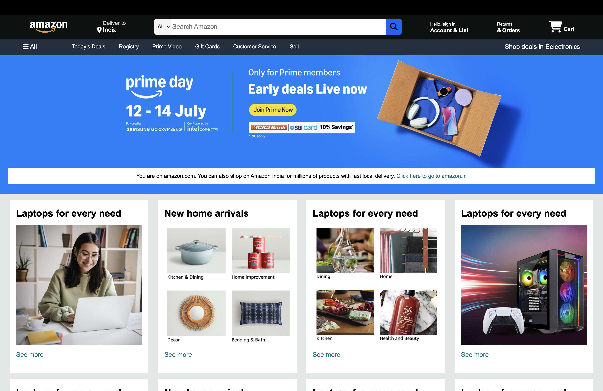

# 🛒 Amazon Home Page UI Clone

Live Demo 👉 [https://amazon-vert-psi.vercel.app](https://amazon-vert-psi.vercel.app)

> ⚠️ This project is built for educational purposes only and is not affiliated with or endorsed by Amazon.

## 📌 Overview

This project is a static front-end clone of the **Amazon home page**. It replicates the layout and look of the desktop version of Amazon using only **HTML** and **CSS**.

⚠️ **Note:** This version is designed only for desktop screens and is **not responsive**.

## 🚀 Features

- Static UI clone of the Amazon homepage
- Clean layout with product grid sections
- Navigation bar with icons and hover effects
- Footer with useful links
- Deployed live using **Vercel**

## 🧰 Tech Stack

- HTML5
- CSS3
- Font Awesome
- Vercel (for deployment)

## 📂 Folder Structure
